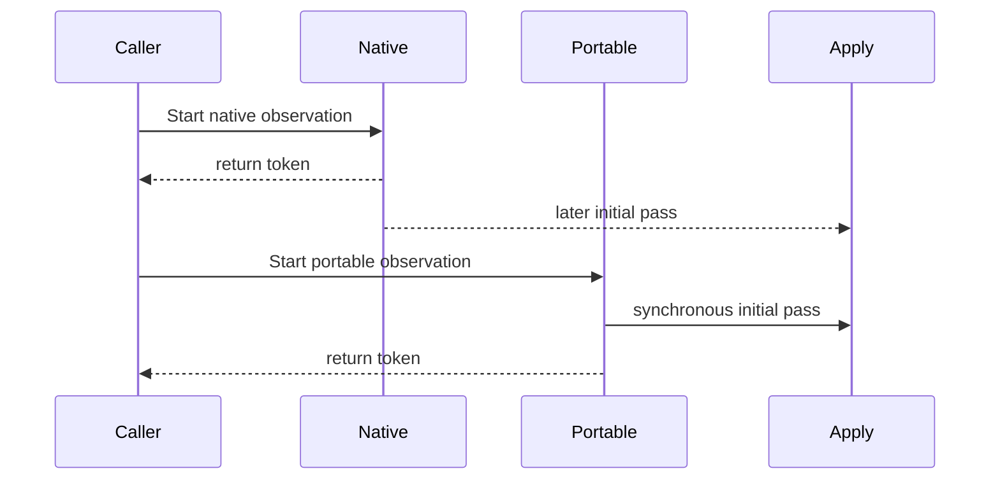
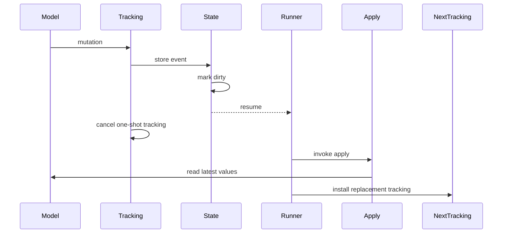
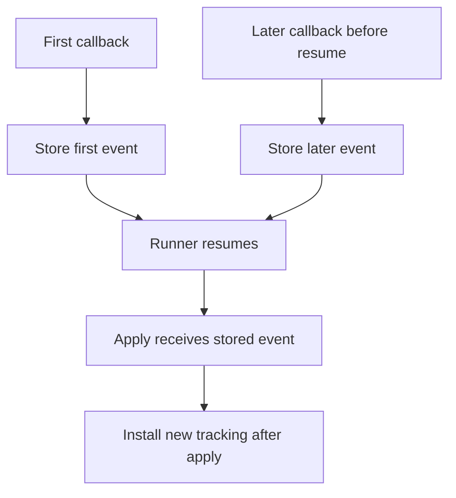

# Continuous Observation Compatibility Investigation

This document records the native `withContinuousObservation` behavior that
ObservationBridge follows for portable mutation delivery. It is an investigation
note, not a versioned release contract.

ObservationBridge intentionally differs from native `withContinuousObservation`
only for the `.initial` pass timing: ObservationBridge delivers `.initial`
synchronously before `withPortableContinuousObservation` returns. Mutation
delivery otherwise follows the native continuous API, except for the documented
iOS 27+ liveness fallback.

## Investigation Scope

The behavior below was verified on June 13, 2026 with:

- Xcode 27 beta toolchain
- Swift 6.4
- iOS 27.0 Simulator
- native `Observation.withContinuousObservation`

The Swift source inspected was the Swift repository at commit `626f109a461`.
The relevant files are:

- `stdlib/public/Observation/Sources/Observation/ContinuousObservation.swift`
- `stdlib/public/Observation/Sources/Observation/ObservationTracking.swift`

## Initial Pass

The `.initial` pass is the one intentional ObservationBridge compatibility
difference.

| API | `.initial` timing | Tracking implication |
| --- | --- | --- |
| native `withContinuousObservation` | Scheduled by the native runner after the token is created | Observable reads must still happen in the `.initial` callback to arm later mutation tracking |
| `withPortableContinuousObservation` | Runs synchronously before the function returns | Observable reads in the synchronous `.initial` callback arm later mutation tracking |

This means ObservationBridge keeps the native "initial is a real tracking pass"
rule, but changes the timing to make UIKit/AppKit binding code immediately render
the first state.



If user code returns from `.initial` before reading the observable properties it
wants to observe, later mutations of those properties are not tracked. That is
native behavior and should remain true for the portable API.

## Native Continuous Observation Model

Native continuous observation stores at most one pending mutation event. A
registrar callback writes an event into `ContinuousObservation.State.event`,
marks the state dirty, and resumes the runner. The runner then invokes `apply`
inside `withObservationTracking(options:)`. Replacement tracking is installed
only after `apply` returns.



The important rules are:

- Mutation callbacks are coalesced through one stored event slot.
- The callback reads the latest observable values at delivery time.
- `event.matches(_:)` compares against the stored event's triggering key path.
- Mutations performed inside `apply` are not delivered by the current tracking.



## Mutation Event Semantics

### Single `.didSet`

For one mutation of `value`, native continuous observation delivers one mutation
pass.

```text
initial: value=0 secondary=0 matches(value)=false matches(secondary)=false
didSet:  value=1 secondary=0 matches(value)=true  matches(secondary)=false
```

ObservationBridge matches this after the synchronous `.initial` pass.

### Single `.willSet`

Native continuous observation delivers a `.willSet` event, but the callback runs
after the mutation has completed, so reads see the new value.

```text
initial: value=0 secondary=0 matches(value)=false matches(secondary)=false
willSet: value=1 secondary=0 matches(value)=true  matches(secondary)=false
```

ObservationBridge delivers `.willSet` with the same post-mutation read behavior.

### `[.willSet, .didSet]`

Native one-shot `withObservationTracking(options:)` can invoke both will-set and
did-set callbacks for one mutation. Native `withContinuousObservation` exposes a
single stored event to the continuous callback. In the observed iOS 27 behavior,
did-set wins for a normal mutation. ObservationBridge follows that precedence:
when both `.willSet` and `.didSet` are requested, `.didSet` is the exposed
continuous pass.

```text
initial: value=0 secondary=0 matches(value)=false matches(secondary)=false
didSet:  value=1 secondary=0 matches(value)=true  matches(secondary)=false
```

ObservationBridge follows the native continuous callback cadence, not the
lower-level one-shot SPI cadence.

## Synchronous Consecutive Mutations

For consecutive synchronous mutations:

```swift
model.value = 1
model.secondary = 2
```

Native continuous observation delivers one mutation pass. The pass reads the
latest values, while `matches(_:)` reports the stored event's trigger.

```text
native .didSet:
initial: value=0 secondary=0 matches(value)=false matches(secondary)=false
didSet:  value=1 secondary=2 matches(value)=true  matches(secondary)=false

native .willSet:
initial: value=0 secondary=0 matches(value)=false matches(secondary)=false
willSet: value=1 secondary=2 matches(value)=true  matches(secondary)=false
```

For `[.willSet, .didSet]`, the observed native continuous result is also one
mutation pass:

```text
initial: value=0 secondary=0 matches(value)=false matches(secondary)=false
didSet:  value=1 secondary=2 matches(value)=true  matches(secondary)=false
```

ObservationBridge coalesces synchronous consecutive mutations into the native
continuous event shape.

## Callback-Internal Mutations

Mutations performed inside the observation callback are not delivered by native
continuous observation.

```swift
withContinuousObservation(options: .didSet) { event in
    _ = model.value
    _ = model.secondary

    if event.kind == .didSet, model.value == 1 {
        model.value = 2
        model.secondary = 3
    }
}
```

Observed native result:

```text
initial: value=0 secondary=0
didSet:  value=1 secondary=0 matches(value)=true
```

ObservationBridge does not keep previous tracking armed through the callback
body in a way that makes callback-internal mutations produce another pass.

## Event Cancellation

Native `ObservationTracking.Event.cancel()` cancels both the event tracking and
the continuous observation state. Calling `event.cancel()` in a mutation pass
stops later deliveries.

Observed native result:

```text
initial: value=0
didSet:  value=1  // event.cancel() called here
// later value=2 mutation is not delivered
```

ObservationBridge mutation events cancel the portable continuous observation
when `event.cancel()` is invoked.

## Compatibility Targets

| Scenario | Native continuous behavior | ObservationBridge behavior |
| --- | --- | --- |
| `.initial` timing | Native scheduled initial pass | Synchronous initial pass before return |
| `.initial` dependency reads | Reads in initial arm later tracking | Same |
| `.didSet` single mutation | One `.didSet`, exact `matches` | Same |
| `.willSet` single mutation | One `.willSet`, reads latest value | Same |
| `[.willSet, .didSet]` single mutation | One exposed mutation pass; observed as `.didSet` | Same |
| Synchronous consecutive `.didSet` mutations | One pass, stored trigger key path | Same |
| Synchronous consecutive `.willSet` mutations | One pass, stored trigger key path | Same |
| Synchronous consecutive `[.willSet, .didSet]` mutations | One exposed mutation pass; observed as `.didSet` | Same |
| Mutation inside callback | No extra pass | Same |
| `event.cancel()` during mutation pass | Stops later deliveries | Same |

## Implementation Notes

The implementation should preserve exact `matches(_:)` for the stored mutation
event on the runtime SPI path.

Fallback behavior for missing SPI is a liveness strategy, not the primary
compatibility model. A fallback may follow native `.initial` timing instead of
the synchronous portable timing, and may use conservative `matches(_:)` if
preserving UI updates is more important than exact filtering on that runtime.
